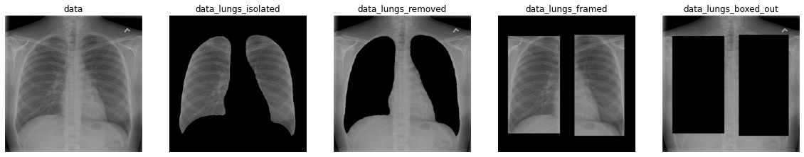
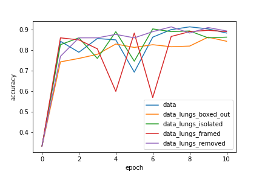

# COVID_19_CXR_CLASSIFICATION
This repository contains the codes for reproducibility of the results using the ROI Hide and Seek Protocol

The new coronavirus unleashed a worldwide pandemic in early 2020, and a fatality rate roughly 10 times that of the flu. As the number of infections soared, and the capabilities for testing lagged behind, chest imaging became essential in the early diagnosis and treatment planning for patients with suspected or confirmed COVID-19 infection. In a few weeks, new methods for lung screening using machine learning (ML) exploded, while quality assurance discussions remain timid. This paper discusses crucial assessments missing in such tools proposed in the recent literature, and shows several blind-spots by running a set of systematic tests over automated methods that offer a more realistic perspective on the advantages and limitations of ML when using a few heterogeneous data sources.

# step 1: set up

## Requirements:
* cv2
* pytorch 1.5.1
* tensorflow 1.15
* PIL
* numpy
* pandas
* torchvision
* matplotlib
* sklearn
* 

## Instalation:

* clone repo
* mkdir base
* cd base
* git clone <url>
* cd ..

# step 2: download data from sources

download datasets according to
https://github.com/lindawangg/COVID-Net/blob/master/docs/COVIDx.md

special instructions:

* mkrdir base/data_sources
* download sources to this folder

# step 3: Create COVIDx

* mkdir base/datasets
* mkdir base/datasets/classification
* mkdir base/datasets/classification/data/train
* mkdir base/datasets/classification/data/test
* run COVID-Net/Create_COVIDx.ipynb making sure to change paths of source folders to ~/base/data_sources/<source> and change destination path to ~/base/datasets/data

# step 4: download segmentation datasets
* for segmentation we use dataset created and described in https://arxiv.org/pdf/1904.09229.pdf
* data is availible at https://github.com/rsummers11/CADLab/tree/master/Lung_Segmentation_XLSor

# step 5: create segmentation datasets
* mkdir base/datasets/segmentation
* mkdir base/datasets/segmentation/NIH_test
* mkdir base/datasets/segmentation/cohen_test
* mkdir base/datasets/segmentation/train
* we will be creating two test sets, one from the cohen dataset masks availible and another from the NIH dataset provided by the XLSor paper
* run ~/base/COVID_19_CXR_CLASSIFICATION/create_LungSegData.ipynb (make sure directories in .ipynb are correct and point to the location that you downloaded these sources)

# step 6: train segmentation model
* mkdir segmentation_models
* run train_unet.py, make sure that the TRAIN_PATH and TEST_PATH and MODEL_PATH point to the correct locations

* TRAIN_PATH = "../../datasets/segmentation/NIH_train"
* TEST_PATH = "../../datasets/segmentation/NIH_test"
* FOLDER_PATH = "../../segmentation_models/UNET_NIH_A_MODEL"

# step 6.5 evaluate segmentation model (optional but recommended)
* run /base/COVID_19_CXR_CLASSIFICATION/segmentation_scripts/eval_unet.py to get the performance metrics of the trained UNET model on the NIH test set and the Cohen Test set for segmentation
expected performance:

## NIH test data set
metric  | class 0 | class 1
------------- | -------------| -------------
recall  | .981 | .968
precision  | .991 | .934
jaccard  | .973 | .906
f1  | .986 | .95
accuracy  | .979 | .979

## Cohen test data set
metric  | class 0 | class 1
------------- | -------------| -------------
recall  | .971 | .919
precision  | .971 | .923
jaccard  | .945 | .854
f1  | .971 | .918
accuracy  | .958 | .958

# step 7: use unet to create modified COVIDx5 datasets
* mkdir base/datasets/classification/data_lungs_removed
* mkdir base/datasets/classification/data_lungs_removed/train
* mkdir base/datasets/classification/data_lungs_removed/test
* mkdir base/datasets/classification/data_lungs_boxed_out
* mkdir base/datasets/classification/data_lungs_boxed_out/train
* mkdir base/datasets/classification/data_lungs_boxed_out/test
* mkdir base/datasets/classification/data_lungs_isolated
* mkdir base/datasets/classification/data_lungs_isolated/train
* mkdir base/datasets/classification/data_lungs_isolated/test
* mkdir base/datasets/classification/data_lungs_framed
* mkdir base/datasets/classification/data_lungs_framed/train
* mkdir base/datasets/classification/data_lungs_framed/test
* run /base/COVID_19_CXR_CLASSIFICATION/segmentation_scripts/create_modified_COVIDx5.ipynb, make sure in folder points to base/datasets/classification/data and out folders point to folders listed above

# step 8: train COVIDnet model on all 5 datasets
* from https://github.com/lindawangg/COVID-Net/blob/master/docs/models.md download COVIDNet-CXR4-A
* follow instructions at https://github.com/lindawangg/COVID-Net/blob/master/docs/train_eval_inference.md to train models using COVIDNet/tf_train.py
* ensure that you comment out line for restoring weights as described in https://github.com/lindawangg/COVID-Net/issues/60
* repeat training for each dataset, changing argument '--datadir' to point to each data set created in step 7 each time
* our results:

* you can also use tf_train_robbie.py as it has the nessecary modifications explained above:

srun -l -u python train_tf_robbie.py --weightspath ../COVIDNetModels/COVIDNet-CXR4-A --metaname model.meta --ckptname model-18540 --trainfile COVID-Net/train_COVIDx5.txt  --testfile COVID-Net/test_COVIDx5.txt --datadir ../datasets/classification/<data-set-name>

# step 9: results:

* after trianing there will be associated numpy files that plot the accuracy metrics over time. 
* taking the max accuracy throughout 10 training epochs for each data set we arrive at these metrics:

## performance metrics accross datasets using COVIDNet-CXR4-A model
dataset | accuracy | sens normal | sens pneumonia | sens covid | ppv normal | ppv pneumonia| ppv covid
------- | ---------|--------------| -------------|--------------|-------------|-------------|------------
data |0.913 |0.96 |0.89 |0.89 |0.857 |0.937 |0.957 |
data_lungs_isolated |0.903 |0.95 |0.85 |0.91 |0.848 |0.966 |0.91 |
data_lungs_removed |0.913 |0.95 |0.85 |0.94 |0.856 |0.924 |0.969 |
data_lungs_framed |0.897 |0.91 |0.89 |0.89 |0.858 |0.899 |0.937 |
data_lungs_boxed_out |0.863 |0.84 |0.83 |0.92 |0.832 |0.83 |0.929 |

## performance metrics accross datasets using COVIDNet-CXR3-A model
dataset | accuracy | sens normal | sens pneumonia | sens covid | ppv normal | ppv pneumonia| ppv covid
------- | ---------|--------------| -------------|--------------|-------------|-------------|------------
data |0.91 |0.95 |0.91 |0.87 |0.896 |0.867 |0.978 |
data_lungs_isolated |0.89 |0.94 |0.82 |0.91 |0.803 |0.943 |0.948 |
data_lungs_removed |0.903 |0.96 |0.81 |0.94 |0.842 |0.931 |0.949 |
data_lungs_framed |0.917 |0.92 |0.92 |0.91 |0.868 |0.929 |0.958 |
data_lungs_boxed_out |0.847 |0.84 |0.82 |0.88 |0.8 |0.812 |0.936 |

## performance metrics accross datasets using pre-trained  resnet50  model
dataset | accuracy | sens normal | sens pneumonia | sens covid | ppv normal | ppv pneumonia| ppv covid
------- | ---------|--------------| -------------|--------------|-------------|-------------|------------
data | 0.933 | 0.95 | 0.93 | 0.92 | 0.905 | 0.921 | 0.979 | 
data_lungs_isolated | 0.917 | 0.96 | 0.89 | 0.9 | 0.873 | 0.957 | 0.928 | 
data_lungs_removed | 0.927 | 0.93 | 0.92 | 0.93 | 0.93 | 0.902 | 0.949 | 
data_lungs_framed | 0.92 | 0.99 | 0.87 | 0.9 | 0.884 | 0.956 | 0.928 | 
data_lungs_boxed_out | 0.897 | 0.94 | 0.86 | 0.89 | 0.832 | 0.925 | 0.947 | 

## performance metrics accross datasets using pre-trained  alexnet  model
dataset | accuracy | sens normal | sens pneumonia | sens covid | ppv normal | ppv pneumonia| ppv covid
------- | ---------|--------------| -------------|--------------|-------------|-------------|------------
data | 0.917 | 0.95 | 0.89 | 0.91 | 0.88 | 0.927 | 0.948 | 
data_lungs_isolated | 0.887 | 0.9 | 0.87 | 0.89 | 0.857 | 0.906 | 0.899 | 
data_lungs_removed | 0.873 | 0.87 | 0.9 | 0.85 | 0.837 | 0.841 | 0.955 | 
data_lungs_framed | 0.91 | 0.92 | 0.9 | 0.91 | 0.893 | 0.882 | 0.958 | 
data_lungs_boxed_out | 0.817 | 0.84 | 0.76 | 0.85 | 0.785 | 0.817 | 0.85 | 

## performance metrics accross datasets using pre-trained  vgg11  model
dataset | accuracy | sens normal | sens pneumonia | sens covid | ppv normal | ppv pneumonia| ppv covid
------- | ---------|--------------| -------------|--------------|-------------|-------------|------------
data | 0.93 | 0.94 | 0.92 | 0.93 | 0.913 | 0.92 | 0.959 | 
data_lungs_isolated | 0.92 | 0.99 | 0.89 | 0.88 | 0.868 | 0.957 | 0.946 | 
data_lungs_removed | 0.91 | 0.91 | 0.9 | 0.92 | 0.892 | 0.9 | 0.939 | 
data_lungs_framed | 0.917 | 0.92 | 0.89 | 0.94 | 0.911 | 0.918 | 0.922 | 
data_lungs_boxed_out | 0.893 | 0.89 | 0.88 | 0.91 | 0.864 | 0.871 | 0.948 | 

